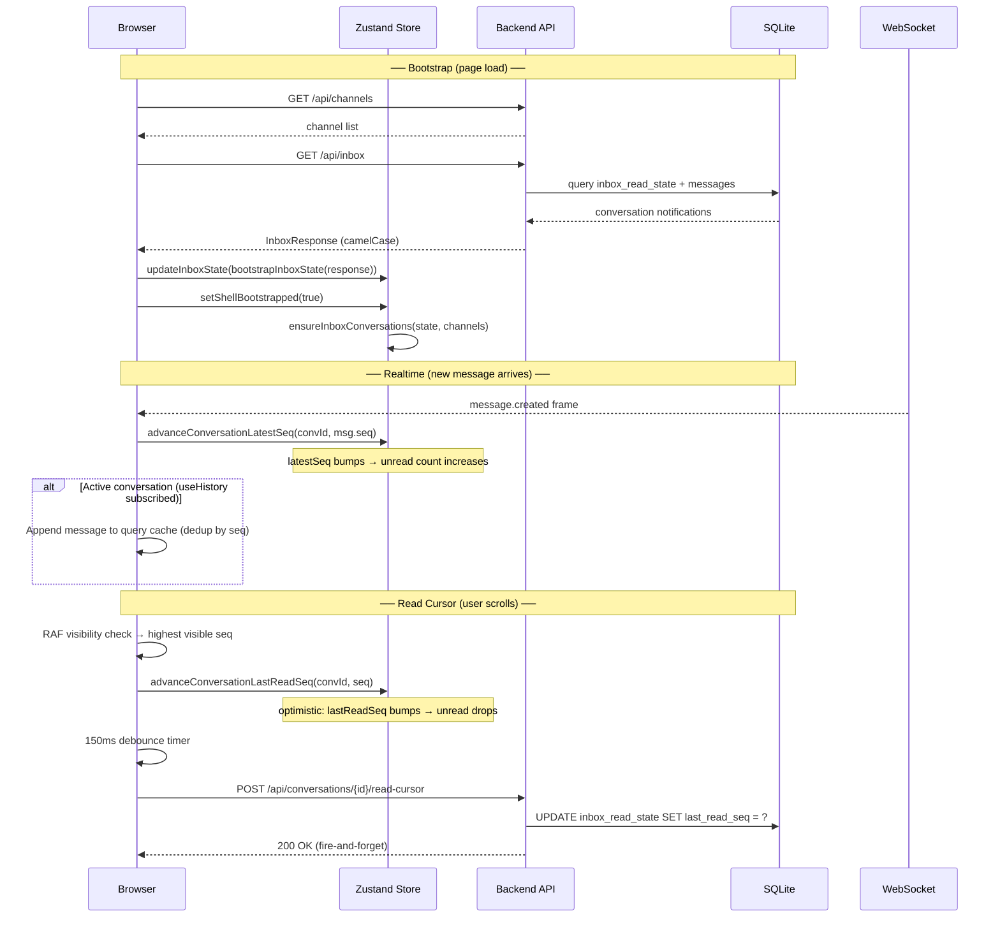
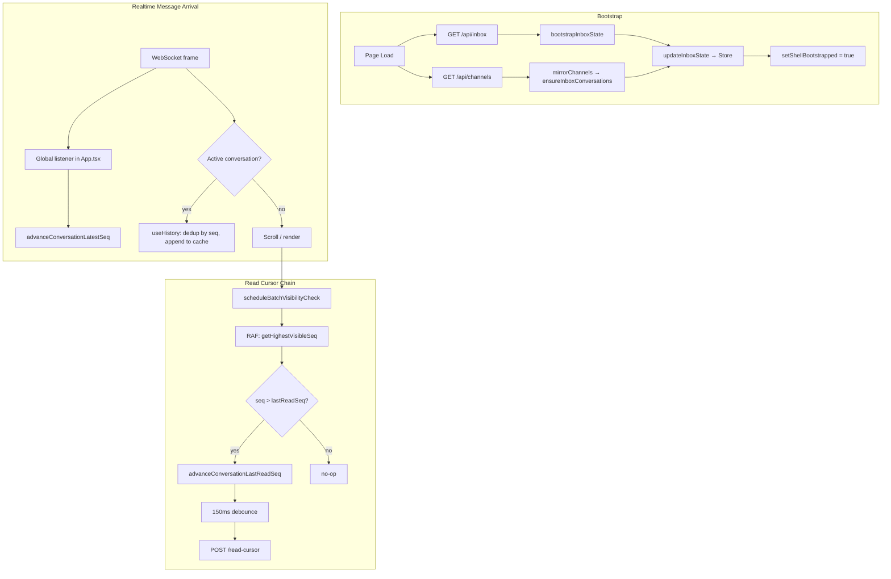

# Inbox Mechanism

How unread counts, read cursors, and inbox state work end-to-end.

---

## Core Concepts

| Concept               | Meaning                                                                 |
| --------------------- | ----------------------------------------------------------------------- |
| **Conversation**      | A channel, DM, or team — identified by `conversationId`                 |
| **Task sub-channel**  | `channel_type='task'` channels reuse the same inbox machinery as regular channels; nothing special. |
| **`latestSeq`**       | Highest message sequence number in a conversation                       |
| **`lastReadSeq`**     | The viewer's read cursor — highest seq they've seen                     |
| **Unread count**      | Derived: `latestSeq - lastReadSeq` (no separate counter)                |
| **Monotonic cursors** | Both `latestSeq` and `lastReadSeq` only advance forward, never backward |

---

## Data Flow





---

## Client State Shape

```typescript
// Zustand store: useStore.getState().inboxState
interface InboxState {
  conversations: Record<string, InboxConversationState>; // keyed by conversationId
}

interface InboxConversationState {
  conversationId: string;
  conversationName: string;
  conversationType: "channel" | "dm" | "team" | "system";
  latestSeq: number;
  lastReadSeq: number;
  unreadCount: number; // server-provided on bootstrap; locally derived after
  lastMessageId?: string;
  lastMessageAt?: string;
}
```

---

## Store Actions

| Action                                        | Trigger                           | Effect                            |
| --------------------------------------------- | --------------------------------- | --------------------------------- |
| `updateInboxState(fn)`                        | Bootstrap, mirrorChannels         | Bulk-replace entire inbox state   |
| `advanceConversationLatestSeq(convId, seq)`   | Realtime message via `useHistory` | `latestSeq = max(current, seq)`   |
| `advanceConversationLastReadSeq(convId, seq)` | `reportVisibleSeq` in MessageList | `lastReadSeq = max(current, seq)` |

All advances are monotonic — they reject stale or duplicate seq values.

---

## Backend

### Database Tables

| Table              | Purpose                                                                 |
| ------------------ | ----------------------------------------------------------------------- |
| `messages`         | Message stream with `(channel_id, seq, id, ...)`                        |
| `inbox_read_state` | Per-member read cursor: `(conversation_id, member_name, last_read_seq)` |

### API Endpoints

| Endpoint                                         | Purpose                                                           |
| ------------------------------------------------ | ----------------------------------------------------------------- |
| `GET /api/inbox`                                 | All conversation notifications for the logged-in user (bootstrap) |
| `GET /api/conversations/{id}/inbox-notification` | Single conversation state (refresh)                               |
| `POST /api/conversations/{id}/read-cursor`       | Advance read cursor (`{ lastReadSeq }`)                           |

The `POST /read-cursor` handler enforces monotonic writes — it will not move `last_read_seq` backward.

All JSON responses use `camelCase` via `#[serde(rename_all = "camelCase")]` on the public response structs.

---

## Read Cursor Pipeline Detail

The read cursor flows through four stages:

1. **Visibility detection** (`useVisibilityTracking`) — RAF-batched `getBoundingClientRect` checks determine the highest visible message seq in the scroll container. Only fires when `document.visibilityState === 'visible'`.

2. **Report** (`reportVisibleSeq` in MessageList) — Guards against moving backward (`seq > lastReadSeqRef`), stale channels (`activeTargetRef !== targetKey`), and loading states.

3. **Optimistic update** — Immediately calls `advanceConversationLastReadSeq` so the sidebar badge drops without waiting for the network.

4. **Debounced HTTP** — A 150ms `setTimeout` batches rapid scroll events into a single `POST /read-cursor` call. The timer is cleared on each new report, so only the final position is persisted.

---

## Invariants

- `lastReadSeq ≤ latestSeq` always (monotonic advances enforce this)
- `latestSeq` only increases: new messages push it forward, nothing decreases it
- `lastReadSeq` only increases: read cursors never move backward
- Bootstrap runs exactly once per session (`bootstrappedRef` guard)
- `ensureInboxConversations` fills zero-stubs for channels missing from the server response
- Channel switches reset `lastReadSeqRef` and `pendingReadSeqRef` in MessageList to avoid cross-channel contamination

---
